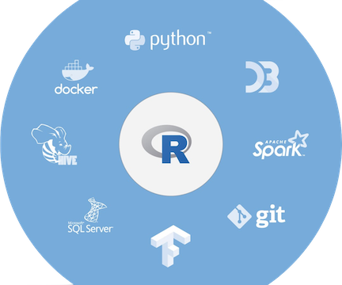

# Interoperability with R

You an use R with many programming languages. This repos contains a few examples of using R with:

* [SQL](https://blog.rstudio.com/2018/10/02/rstudio-1-2-preview-sql/)
* [Python](https://blog.rstudio.com/2018/10/09/rstudio-1-2-preview-reticulated-python/)
* [D3](https://blog.rstudio.com/2018/10/05/r2d3-r-interface-to-d3-visualizations/)

Additionally, R Markdown suppoorts these and many other language engines, including: `bash`, `scala`, `sas`, `stata`, `julia`, and many [more](https://bookdown.org/yihui/rmarkdown/language-engines.html).

R has a long history of working with other languages. For a brief introduction, see [What is R?](https://www.r-project.org/about.html)